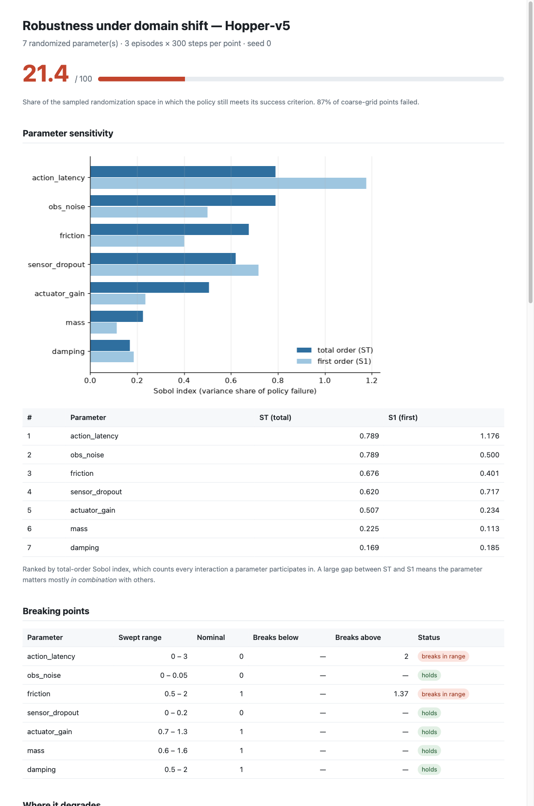

# sim2real-score

[](https://github.com/TarunYadgirkar/sim2real-score/actions/workflows/ci.yml)

A policy trained in simulation eventually meets a robot whose friction, mass, and
actuator response are all a little different from the model it learned on.
`sim2real-score` takes a trained control policy and a MuJoCo environment and
answers two questions before that happens: **which** mismatch breaks the policy,
and **at what value**. It emits a robustness report and the domain-randomization
ranges to train over next.

- **Loads** stable-baselines3 checkpoints, TorchScript `.pt`, and ONNX policies.
- **Randomizes** friction, mass, damping, actuator gain, observation noise,
  action latency, and sensor dropout — configured in YAML, with defaults per env.
- **Sweeps** a coarse grid to map degradation, and separately bisects from
  nominal outward to locate the failure boundary per parameter. Grid and Sobol
  rollouts run in parallel across CPU cores; bisection is sequential by nature.
- **Ranks** parameters by **Sobol total-order indices** rather than one-at-a-time
  deltas. Robots tend to fail on a conjunction — friction a little low *and* a
  step of actuator lag — where neither parameter looks dangerous swept alone. A
  total-order index credits a parameter for every interaction it takes part in
  instead of discarding them, and the report ships the second-order matrix so you
  can see which pairs are doing it. It ranks *within* one policy, not fragility
  *across* policies — [why](#reading-the-indices-correctly).
- **Outputs** a single robustness score, per-parameter breaking points, an
  interaction matrix, a self-contained HTML report, and a suggested DR config.

## What it measures, on policies I trained

Two PPO policies on Hopper-v5, both checked into `experiments/policies/`: one
trained at fixed nominal friction, one with friction randomized every episode.
At half friction the nominal-trained policy keeps **25%** of its nominal return;
the randomized one keeps **43%**, and pays for it in peak return (3106 → 930 at
nominal). Those returns were measured during training and are recorded in
`experiments/policies/manifest.json`. `sim2real-score` recovers that difference
without retraining anything —
[the validation](#validation-on-trained-policies) runs straight from the repo.



*Top of [`demo/report_hopper.html`](demo/report_hopper.html) — that same
nominal-trained Hopper policy, all seven parameters swept at `max_steps: 300`. It
scores 21.4/100, and the tool locates the edges: two steps of actuator lag, or
friction 1.37× nominal. Open the HTML for the
degradation curves, the interaction heatmap, and the suggested DR config; the
exact command is in [`demo/README.md`](demo/README.md). GitHub serves committed
`.html` as raw source, hence the screenshot.*

## Usage

```bash
python examples/export_example_policies.py --out example_policies
sim2real-score run --policy example_policies/friction_overfit.pt --env linear --out out
```

```
robustness score : 87.5/100
most sensitive   : mass, friction, damping, actuator_gain, obs_noise, action_latency, sensor_dropout
  mass            holds across range
  friction        below 0.382
  damping         holds across range
  actuator_gain   above 1.49
  obs_noise       holds across range
  action_latency  holds across range
  sensor_dropout  holds across range
report           : out/report.html
suggested DR     : out/dr_config.yaml
```

That run is checked in as [`demo/report.html`](demo/report.html)
([screenshot](demo/report.png)) — no MuJoCo needed, the `linear` env is built in.
On a real environment and an SB3 checkpoint:

```bash
sim2real-score run --policy model.zip --policy-kind sb3 --env Hopper-v5 --out out
```

Every run writes `report.html` (self-contained, plots inlined as data URIs),
`dr_config.yaml` (ready to train against), and `result.json`.

Useful flags: `--policy-kind {auto,sb3,torch,onnx}`, `--config space.yaml`,
`--seed N`, `--jobs N`, `--serial`, `--sobol-base N`, `--grid-res N`.
`sim2real-score envs` lists the built-in env defaults.

### Python API

```python
from sim2real_score import run_analysis, default_space, load_policy
from sim2real_score.report import build_report

policy = load_policy("policy.onnx")
result = run_analysis(policy, "Hopper-v5", default_space("Hopper-v5"), seed=0, jobs=8)

print(result.score)                        # 0..100
print(result.sensitivity.ranking())         # most influential first
print(result.breaking_points["friction"])   # BreakingPoint(low=..., high=...)
build_report(result, "out/")
```

## Install

```bash
git clone https://github.com/TarunYadgirkar/sim2real-score.git
cd sim2real-score
uv venv --python 3.11 && uv pip install -e ".[dev,torch,onnx]"
```

That is enough to run the quickstart above end to end. For real environments and
stable-baselines3 checkpoints, add:

```bash
uv pip install -e ".[sb3,mujoco]"
```

The core package depends on neither torch nor MuJoCo, and tests for an absent
backend skip cleanly rather than failing.

> On Intel macOS, torch stops at 2.2.2, which rejects numpy 2.x. Pin `numpy<2`
> if you install the torch/sb3 extras there.

## Policy interfaces

| Kind | File | Contract |
|---|---|---|
| `sb3` | `.zip` | A PPO, SAC, TD3, A2C, DDPG or DQN checkpoint; called with `deterministic=True`. |
| `torch` | `.pt` | **TorchScript** module, float32 `[N, obs_dim] -> [N, action_dim]`. |
| `onnx` | `.onnx` | Single input/output, float32 `[N, obs_dim] -> [N, action_dim]`. |

`examples/export_example_policies.py` exports working `.pt` and `.onnx` policies
in the expected form.

## Randomization space

```yaml
env: Hopper-v5
seed: 0
rollout: { episodes: 3, max_steps: 300 }
# `metric` is reserved — episode return is the only implemented metric.
failure: { metric: return, threshold: 0.6, threshold_kind: fraction_of_nominal }
params:
  friction:       {nominal: 1.0, low: 0.5, high: 2.0, kind: multiplicative}
  action_latency: {nominal: 0,   low: 0,   high: 3,   kind: int}
  obs_noise:      {nominal: 0.0, low: 0.0, high: 0.05, kind: additive_std}
  sensor_dropout: {nominal: 0.0, low: 0.0, high: 0.2, kind: probability}
```

A parameter is swept only when `low != high`, so pinning one to nominal removes
it from the analysis. `threshold_kind` is `mean_reward`, `absolute`, or
`fraction_of_nominal`. `friction`/`mass`/`damping` are applied to the simulator
model; the rest are applied by a wrapper and work on any environment.

### Targeting one part of the robot

Global multipliers rescale the whole model, which changes the task rather than
probing a weak spot. Dynamics parameters can name a single element instead:

```yaml
params:
  friction.foot_geom: {nominal: 1.0, low: 0.3, high: 2.0, kind: multiplicative}
  damping.leg_joint:  {nominal: 1.0, low: 0.5, high: 2.0, kind: multiplicative}
  mass.torso:         {nominal: 1.0, low: 0.8, high: 1.5, kind: multiplicative}
```

Targets resolve to geoms (`friction`), bodies (`mass`), and joints (`damping`).
Targeted and global factors compose, and an unknown name raises at the first
rollout that touches it, with the valid names listed. Wrapper parameters take no
target.

### SB3 policies trained under VecNormalize

```bash
sim2real-score run --policy model.zip --vecnormalize vecnormalize.pkl --env Hopper-v5
```

Without this the policy receives raw observations and you measure a different
policy than the one you trained.

## How the score works

`robustness_score = 100 × mean(success_rate)` over the Sobol-sampled space, where
each sampled point contributes the fraction of its episodes that met the success
criterion. Sensitivity analyses the **failure indicator** `1 - success_rate`, so
the variance being decomposed is variance in what actually breaks the policy.
A large gap between `ST` and `S1` for a parameter means it matters mostly *in
combination* with others.

One exception worth knowing: if every parameter is pinned (`low == high`) there is
no space to sample, and the score comes back as `100.0` without a single
randomized rollout. The report prints "No active parameters were swept" in that
case — read it as *not measured*, not as *perfect*.

The suggested DR config pushes each range past its measured breaking point,
further for parameters with a high total-order index, while keeping ranges on the
same physical scale as the value they broke at. It is only meaningful for a policy
that works at nominal: if the policy already fails at nominal there is no boundary
to find, the ranges collapse to the nominal value, and the config header says so.

### Reading the indices correctly

**Sobol indices rank parameters within one policy. They do not compare
fragility across policies.** They are *normalized* variance shares, so a policy
that fails almost everywhere has little variance left to attribute and can show a
*lower* ST than a more robust policy — and with a single active parameter, ST is
~1 by construction. To compare two policies, use the **score** and the **breaking
points**. Rather than charting an uninformative ranking, the HTML report, the CLI
summary and the suggested DR config all say so explicitly when the analysis is
degenerate; the report additionally flags the single-active-parameter case.

Sample size is the other caveat. The default `--sobol-base 32` is a fast default,
not a converged one. An `S1` estimate outside `[0, 1]` is the textbook symptom of
an unconverged estimator — both committed demo reports contain one (friction at
`S1 = -0.095` in `demo/report.html`, `action_latency` at `S1 = 1.176` in
`demo/report_hopper.html`, which was run at `--sobol-base 8`) — and it means small
differences down the ranking tail are noise. Raise `--sobol-base` (powers of two
sample best) for numbers you intend to quote.

## Validation on trained policies

The analytic fixtures prove the ranking logic; `experiments/train_dr_policies.py`
checks it against real learned controllers. It trains two PPO policies on
Hopper-v5 — one at fixed nominal friction, one with friction randomized every
episode — and `tests/test_trained_policy_validation.py` asserts the tool sees the
difference. The assertions are *relative*, never absolute index or band values,
because a trained network's exact numbers depend on the run:

- the DR-trained policy scores higher,
- its survivable friction band is wider,
- it breaks later as friction drops,
- and the nominal-trained policy's band is narrow and brackets exactly the
  friction it trained at.

Ground truth for the gap comes from outside the tool: `experiments/policies/manifest.json`
records the returns measured during training, where the nominal-trained policy
retains 25% of its nominal return at half friction against the DR-trained
policy's 43%, bought by giving up peak return (3106 → 930). The trained policies
are committed, so the validation runs without retraining; it needs the
`[sb3,mujoco]` extras and skips cleanly without them.

## Determinism

Every rollout is a pure function of `(policy, params, seed, index)`; per-episode
seeds derive from `numpy.SeedSequence`, never from wall clock or worker identity.
Consequently **serial and parallel runs produce byte-identical `result.json`**,
and reports reproduce exactly. The test suite asserts that equality, and a second
test checks that the executor's parallel path really engages: work lands in worker
processes and no fallback warning fires. That guard covers the executor itself,
not the analysis path — a payload that failed to pickle inside `run_analysis`
would still fall back to serial with only a warning.

## Tests

```bash
pytest
```

The suite is the ground truth (see `SPEC.md` §7). Fragility has to be *provable*
for the test to mean anything, and a trained network's sensitivity cannot be
guaranteed cheaply — so ground truth comes from a linear plant with linear
feedback, where stability is analytic. It builds two policies that break through
genuinely independent mechanisms — one that cancels friction at nominal
(destabilizes when friction drops, keeps its delay margin) and one with strong
derivative gain (swamps friction variation, loses phase margin under delay) — and
asserts the tool ranks each correctly and that **the ranking flips between them**.
Each fixture's ground-truth property is verified by direct measurement, so the
tests check the tool rather than a circular fixture. MuJoCo and Hopper are
exercised separately, by the trained-policy validation above.

Tests for optional backends skip cleanly when the backend is absent, which is what
the CI job above runs: core dependencies only, no deep-learning stack.

`DECISIONS.md` logs the non-obvious calls, including two the measurements
overturned: the ground-truth fixtures first measured *backwards*, because
friction-fragility and latency-fragility collapse onto the same axis unless the
two policies fail through genuinely independent mechanisms (D8), and a validation
test asserted the wrong direction of a Sobol index until the data corrected it
(D16).

## Layout

```
src/sim2real_score/
  policies/     protocol, in-memory policies, sb3/torchscript/onnx loaders
  envs/         linear (built-in), mujoco wrapper, registry + defaults
  randomization/ space (YAML) + DomainShiftWrapper
  rollout/      deterministic runner, serial/parallel executor
  sweep/        coarse grid, bisection
  sensitivity/  Saltelli sampling + Sobol S1/ST/S2
  analysis.py   orchestration, score, suggested DR config
  report/       plots + self-contained HTML
demo/           two real reports (linear and Hopper-v5) + screenshots
experiments/    PPO training script and the two checked-in policies
```

## License

MIT
</content>
